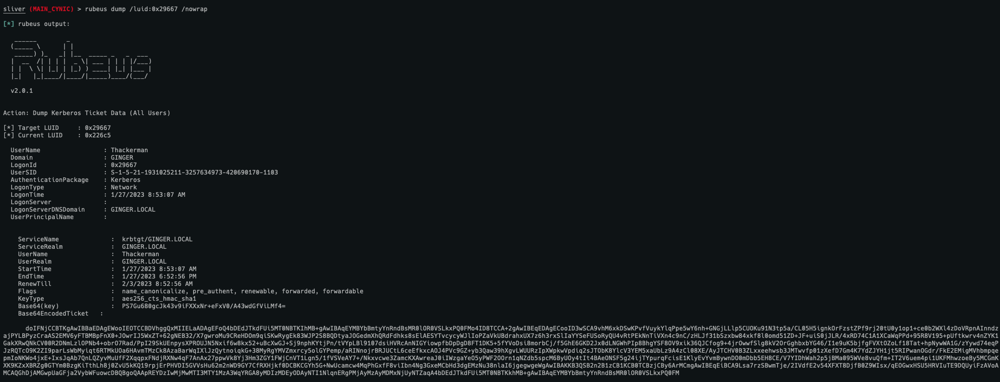

Just some powershell to get an AD lab setup.

bAD.md = Initial Setup of Active Directory. The powershell commands will need to be run on the domain controller and the workstation computer so it's not automated but it shouldn't take too long.

bAD-kerberoast.ps1 = Run on domain controller, will set up a service account named kirby that can be kerberoasted.

bAD-UKD.ps1 = Run on domain controller, will give trusted for delegation rights to the other machine. 

## Testing Guide
# Kerberoasting (payload on non domain controller run as wadmin)

# Unconstrained Delegation

*Please note information such as luids, tickets, etc... may change, it took me a few minutes to get it working in sliver*

Using sharpview to search for unconstrained delegation

Nothing to exploit

Cannot view c$ on Domain Controller

Authenticate to machine somehow, I just ls'd into the machine as Thackerman

Dump the resulting luid with rubeus

Pass the Ticket to current luid with rubeus

Profit

